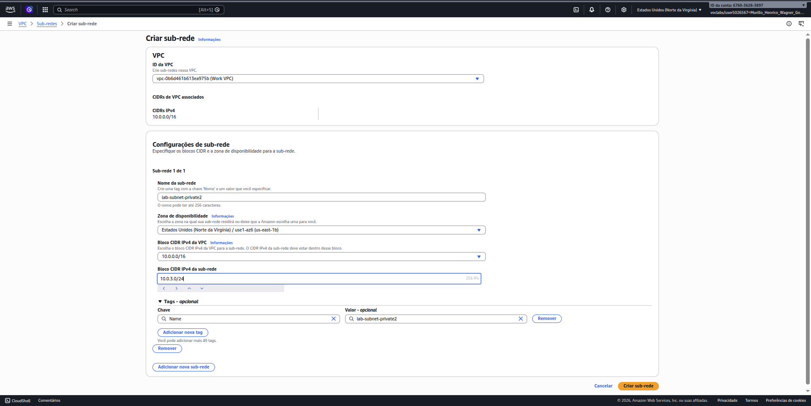
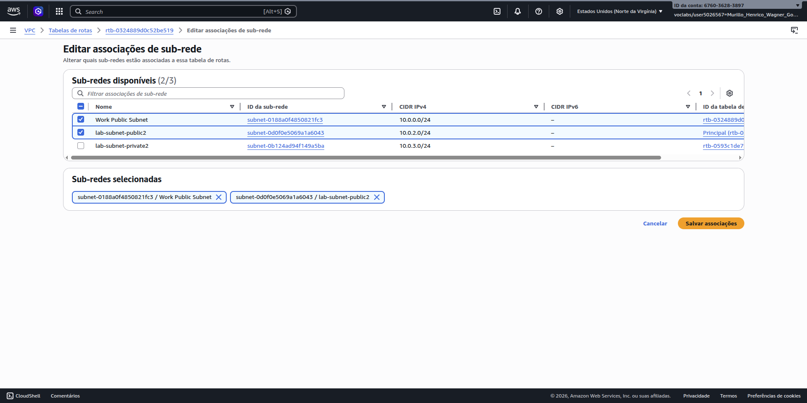
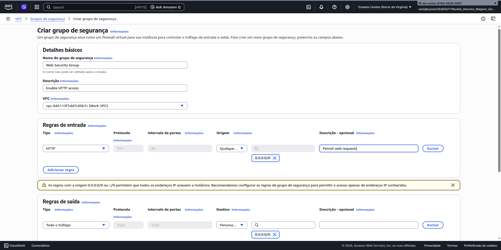
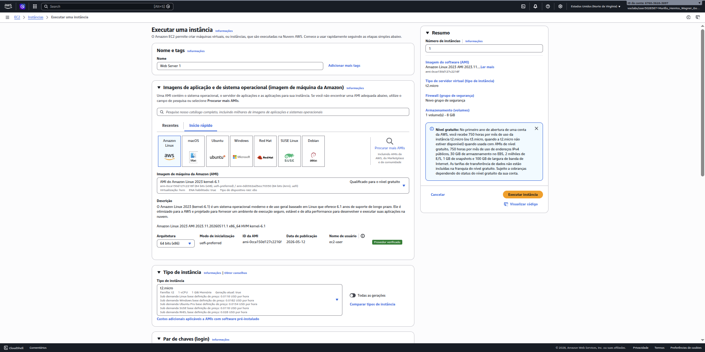
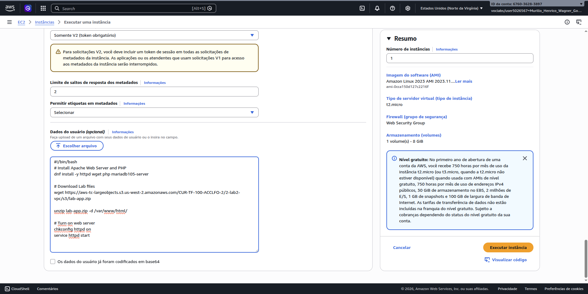
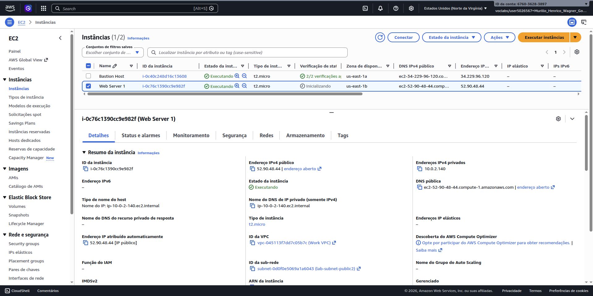
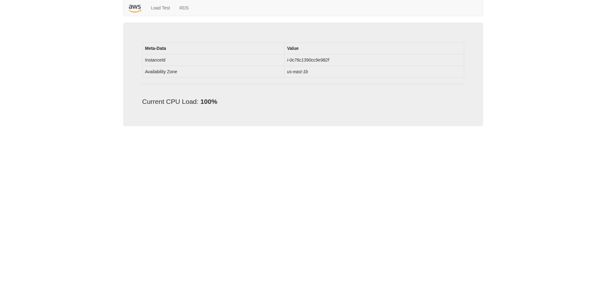

# AWS VPC + EC2 Web Server Lab

## Overview

This project documents the deployment of a web server infrastructure in AWS using Amazon VPC, public and private subnets, route tables, security groups, and an EC2 instance.

The lab focused on creating a multi-subnet network architecture and deploying an Apache/PHP web application using EC2 User Data automation.

---

# Objectives

* Create additional public and private subnets
* Configure routing between subnets and gateways
* Configure Security Groups for HTTP access
* Launch an EC2 web server instance
* Automate server provisioning using User Data scripts
* Validate public web access to the application

---

# Technologies Used

* Amazon VPC
* Amazon EC2
* Security Groups
* Route Tables
* Internet Gateway (IGW)
* NAT Gateway
* Amazon Linux 2023
* Apache HTTP Server
* PHP
* EC2 User Data

---

# Architecture

The environment was configured with:

* Public subnet for internet-facing resources
* Private subnet for internal resources
* Route tables for public and private traffic routing
* Internet Gateway for public internet access
* NAT Gateway for outbound internet access from private subnets
* EC2 instance configured as a web server

Basic architecture flow:

```text
Internet
   │
Internet Gateway
   │
Public Subnets
   │
NAT Gateway
   │
Private Subnets
```

---

# Lab Steps

## Step 1 — Create Additional Public Subnet

A second public subnet was created in a different Availability Zone to support a more resilient and highly available network architecture.

### Configuration

| Setting           | Value              |
| ----------------- | ------------------ |
| Subnet Name       | lab-subnet-public2 |
| CIDR Block        | 10.0.2.0/24        |
| Availability Zone | us-east-1b         |

### Screenshot


---

## Step 2 — Create Additional Private Subnet

A second private subnet was created in a separate Availability Zone.

### Configuration

| Setting           | Value               |
| ----------------- | ------------------- |
| Subnet Name       | lab-subnet-private2 |
| CIDR Block        | 10.0.3.0/24         |
| Availability Zone | us-east-1b          |

### Screenshot



---

## Step 3 — Configure Route Table Associations

The public route table was associated with the second public subnet.

This allows internet-bound traffic to be routed through the Internet Gateway.

### Screenshot



---

## Step 4 — Create Security Group

A Security Group was configured to allow HTTP traffic from the internet.

### Inbound Rule

| Type | Source        | Description         |
| ---- | ------------- | ------------------- |
| HTTP | Anywhere-IPv4 | Permit web requests |

### Screenshot



---

## Step 5 — Launch EC2 Web Server

An EC2 instance running Amazon Linux 2023 was launched inside the public subnet.

### EC2 Configuration

| Setting        | Value              |
| -------------- | ------------------ |
| Instance Name  | Web Server 1       |
| Instance Type  | t2.micro           |
| AMI            | Amazon Linux 2023  |
| Subnet         | lab-subnet-public2 |
| Public IP      | Enabled            |
| Security Group | Web Security Group |

### Screenshots



.png)

---

## Step 6 — Configure User Data Automation

A User Data script was configured to automatically install and configure the web server during instance launch.

### User Data Script

```bash
#!/bin/bash
# Install Apache Web Server and PHP
dnf install -y httpd wget php mariadb105-server

# Download Lab files
wget https://aws-tc-largeobjects.s3.us-west-2.amazonaws.com/CUR-TF-100-ACCLFO-2/2-lab2-vpc/s3/lab-app.zip

unzip lab-app.zip -d /var/www/html/

# Turn on web server
chkconfig httpd on
service httpd start
```

### What the script does

* Installs Apache Web Server
* Installs PHP and database libraries
* Downloads the lab web application
* Deploys files into the Apache web directory
* Starts the HTTP service automatically

### Screenshot



---

## Step 7 — Validate EC2 Instance

The EC2 instance was successfully launched and reached the running state.

### Screenshot



---

## Step 8 — Validate Web Application Access

The web server was successfully accessed using the EC2 Public IPv4 DNS address.

The application displayed AWS branding and EC2 metadata information, confirming that the Apache web server and PHP application were functioning correctly.

### Screenshot



---

# Results

The infrastructure was successfully deployed and tested.

The lab demonstrated:

* AWS VPC networking concepts
* Public and private subnet separation
* Route table configuration
* Internet Gateway and NAT Gateway usage
* Security Group management
* EC2 deployment
* Automated provisioning using EC2 User Data
* Web server deployment in AWS

---

# Lessons Learned

During this lab, the following cloud and networking concepts were practiced:

* Designing segmented AWS VPC architectures
* Configuring subnet routing
* Understanding public vs private resources
* Managing inbound traffic with Security Groups
* Deploying EC2 instances securely
* Automating server provisioning with User Data scripts
* Troubleshooting AWS networking configurations
